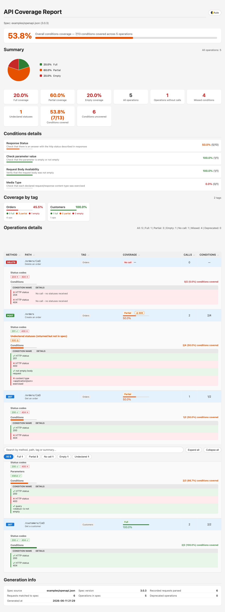

# OpenAPI Coverage Report

A small, dependency-light tool that answers one question for an API test suite:

> **Which operations, status codes, parameters and request bodies described in
> my OpenAPI spec did my tests actually exercise — and what did they hit that
> the spec doesn't describe?**

It records what your tests send, compares it against a live or local OpenAPI
3.x / Swagger 2.0 document, and renders a single self-contained, interactive
**HTML report** (no server, no external assets).



## Why

The widely used `swagger-coverage` CLI is effectively unmaintained and does not
parse OpenAPI 3.1. This tool is a self-contained replacement:

- Parses OpenAPI **3.0.x and 3.1.x** (and Swagger 2.0) with plain Jackson — no
  swagger-parser dependency.
- Produces a modern, **interactive** single-file HTML report.
- Records coverage straight from **REST Assured** via a tiny filter (or from any
  source that writes the simple JSON record format described below).

## How it works

```
  ┌─────────────┐   per-request JSON     ┌──────────────────────┐   HTML
  │ Your tests  │ ─────────────────────► │  coverage-output/     │ ─────────►  coverage-report.html
  │ (REST       │  OpenApiCoverageFilter │  *-coverage.json      │  reporter
  │  Assured)   │                        └──────────────────────┘
  └─────────────┘                                   ▲
                                                    │  compared against
                                          ┌──────────────────────┐
                                          │ OpenAPI 3.x spec      │
                                          │ (URL or local file)   │
                                          └──────────────────────┘
```

1. **Record** — `coverage.restassured.OpenApiCoverageFilter` writes one tiny JSON
   record per HTTP request (method, path, params, body-present, status code).
   Sensitive header values (auth tokens, API keys, cookies) are recorded by name
   only, never by value.
2. **Analyze** — `coverage.CoverageComparator` loads the spec, matches each
   recorded request to a spec operation (templated paths and any deployment base
   path are handled automatically), and evaluates coverage *conditions*.
3. **Report** — `coverage.HtmlReportGenerator` renders the interactive HTML.

## Add it to your build

Gradle:

```gradle
dependencies {
    testImplementation 'io.github.dm9tr0:openapi-coverage-report:0.2.0'
}
```

Maven:

```xml
<dependency>
  <groupId>io.github.dm9tr0</groupId>
  <artifactId>openapi-coverage-report</artifactId>
  <version>0.2.0</version>
</dependency>
```

> REST Assured is a `compileOnly` dependency of this library, so it is **not**
> pulled in transitively. The core engine (spec parsing, coverage analysis, HTML
> report) needs only Jackson + SLF4J. The optional
> `coverage.restassured.OpenApiCoverageFilter` requires REST Assured on your test
> classpath — which test projects already have.

> **Logging:** the library logs through SLF4J and ships **no** binding, so it
> never conflicts with your logging setup. If you want to see its logs, make sure
> your project has an SLF4J binding on the classpath — most do (e.g. Logback). For
> a bare project, the simplest option is `org.slf4j:slf4j-simple`.

## Usage

### 1. Record coverage in your tests

Register the filter on your REST Assured requests, pointing it at an output
directory:

```java
import coverage.restassured.OpenApiCoverageFilter;
import io.restassured.RestAssured;
import java.nio.file.Path;

RestAssured.filters(new OpenApiCoverageFilter(Path.of("build/coverage-output")));
```

Run your test suite as usual — one `*-coverage.json` file is written per request.

### 2. Generate the report in your project

The report generator is a `main` class (`coverage.OpenApiCoverageReporter`) —
there is no Gradle plugin, so wire a `JavaExec` task into your own
`build.gradle`:

```gradle
// SLF4J binding for the reporter's console logs only — kept off the
// published/runtime classpath so it never clashes with your logging setup.
configurations { coverageLogging }
dependencies { coverageLogging "org.slf4j:slf4j-simple:2.0.18" }

tasks.register("coverageReport", JavaExec) {
    classpath = sourceSets.test.runtimeClasspath + configurations.coverageLogging
    mainClass = "coverage.OpenApiCoverageReporter"
    args(
        "https://api.example.com/v3/api-docs",  // spec URL or local file
        "",                                      // fallback spec path ("" = none)
        "build/coverage-output",                 // recorded *-coverage.json dir
        "build/reports",                         // output dir
        // optional flags:
        "--min-coverage", "70",                  // exit 2 if coverage < 70%
        "--config", "openapi-coverage.conf")     // ignore/filter rules
}
```

Run it after your tests:

```bash
./gradlew test coverageReport
```

Arguments — positional first, then optional flags (anywhere):

| Arg | Meaning |
|-----|---------|
| `specUrlOrFile` | OpenAPI document — an `http(s)` URL **or** a local file path |
| `fallbackSpecPath` | Local spec used if the first can't be loaded (`""` for none) |
| `coverageOutputDir` | Directory of recorded `*-coverage.json` files |
| `outputDir` *(optional)* | Where reports are written (default `build/reports`) |
| `--min-coverage <N>` *(optional)* | Exit code **2** if coverage % is below N (CI gate) |
| `--config <path>` *(optional)* | Path to a config file (see below) |

Outputs written to `<outputDir>`:

- `coverage-report.html` — the interactive report
- `coverage-report.json` — machine-readable result for CI (metrics, gating)

### 3. Optional config (`openapi-coverage.conf`)

A flat `key = value` file (no JSON). It only ever *removes* things from the
coverage denominator — with no config the tool runs with sensible defaults:

```
# one setting per line; '#' starts a comment, blank lines are ignored
ignore-deprecated = true
ignore-status = 500
ignore-status = 503
ignore-operation = POST /internal/.*
ignore-operation = /admin/.*
```

| Key | Effect |
|-----|--------|
| `ignore-deprecated` | `true`/`false` — drop deprecated operations from coverage |
| `ignore-status` | a status code (repeat for several) — stops counting as a condition |
| `ignore-operation` | `[METHOD] <path-regex>` — drop matching operations (method optional) |

## What the report shows

- **Overall conditions coverage** with an at-a-glance banner and donut chart.
- **Per-operation** coverage: status codes, parameters (defined vs sent), and a
  request-body check — each condition coloured green (covered) / red (not), with
  details (e.g. `Undeclared status: 400`).
- **Coverage by tag** — per-tag rollups taken from the spec's operation tags.
- **Undeclared statuses** — a separate, opt-in signal for operations that returned
  a status code the spec does not describe. These are **not** counted against
  coverage (the spec is the gap, not the test), but are surfaced via a badge,
  a filter, and a summary count so they're easy to find.
- **Search, filters, deep-links** — filter by coverage/tag/missing-condition,
  search by method/path/tag/summary, and share a URL hash that restores the view.
- **Worst-first ordering**, expand/collapse, sortable columns.
- **Automatic light/dark theme** following the browser, with a manual toggle.
- **Generation info** — spec source, requests parsed/matched, operation count,
  deprecated count, and a timestamp.

## The coverage model

For every operation in the spec the reporter evaluates *conditions*:

- **Response Status** — one per documented status code; covered when that status
  was actually received.
- **Check parameter value** — each documented query/header parameter; covered when
  sent at least once.
- **Request Body Availability** — for body methods (POST/PUT/PATCH); covered when a
  non-empty body was sent.

Coverage percentage = covered conditions / total conditions. Operations are
classified **Full / Partial / Empty / No call**.

> **Undeclared statuses are deliberately excluded from the percentage.** An
> operation whose documented behaviour is fully exercised should not be penalised
> for also returning an undocumented status — that's a spec gap, surfaced
> separately, not a test gap.

## Path matching

Recorded request paths are matched to spec operations with templated-path regex
(`/orders/123` matches `/orders/{id}`). Any deployment **base path** is absorbed
automatically: the matcher tries the full recorded path, then progressively strips
leading segments until it matches a spec path — so `/api/orders/1` matches a spec
that declares `/orders/{id}` with no configuration.

## The coverage record format

Each file under the coverage output directory is a minimal JSON document
(`"format":"openapi-coverage-v1"`). You can produce it from any HTTP layer, not
just REST Assured:

```json
{
  "format": "openapi-coverage-v1",
  "paths": {
    "/orders": {
      "post": {
        "parameters": [{ "name": "Accept", "in": "header", "value": "*/*" }],
        "requestBody": { "present": true, "contentType": "application/json" },
        "mediaTypes": ["application/json"],
        "responses": { "201": {} }
      }
    }
  }
}
```

## Try the bundled example

A tiny spec and a handful of recorded requests live under `examples/`:

```bash
./gradlew coverageReport -PreportArgs="\
  examples/openapi.json examples/openapi.json \
  examples/coverage-output examples/report"
# open examples/report/coverage-report.html
```

It produces the report shown in the screenshot above (a mix of Full / Partial /
No-call operations, an undeclared status, and a deprecated operation).

## Building and testing

```bash
./gradlew assemble        # compile the engine + filter
./gradlew test            # run the unit tests
./gradlew coverageReport  # generate a report (see Usage)
```

Requires a JDK 21+. The engine depends only on Jackson and SLF4J; the optional
REST Assured filter needs REST Assured on your test classpath. Tests use JUnit 5
and AssertJ.

## License

[MIT](LICENSE).
